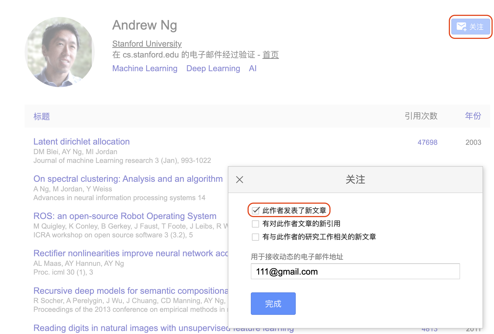

# 论文订阅

## 谷歌学术

### 订阅作者新工作

在谷歌学术中搜索想要订阅的作者, 点击右上角关注, 勾选"此作者发表了新文章".

<!--  -->

### 根据关键词订阅

进入谷歌学术[官网](https://scholar.google.com), 点击左上角, 选择**快讯**, 填入对应关键词, 选择邮件地址, 即可订阅相关论文.

> [快讯页面](https://scholar.google.com/scholar_alerts?view_op=list_alerts)中只能看到你当前登录的谷歌账号对应邮箱的快讯, 订阅到其他邮箱的快讯可以在订阅时谷歌发送的邮件中取消订阅.

### 注: 谷歌常用语法规则

1. **使用双引号**：在关键词或短语前后加上双引号(" ")，可以搜索到包含这完全相同短语的文献。
2. **使用减号**：在关键词前面加上减号(-)，可以排除含有该关键词的搜索结果。
3. **使用 OR 操作符**：OR 操作符可用于搜索包含两个关键词中任何一个的文献。
4. **使用 AND 操作符**：AND 操作符可以用来限定搜索结果必须同时包含两个关键词。
5. **使用星号**：星号(*)是通配符，可以代替一个或多个单词。
6. **使用括号**：括号可以用来更改搜索的优先级，被括起来的词会被优先搜索。
7. **使用“site:”**：这个操作符可以用来在特定网站或域名中搜索。例: "site: ieee.org"
8. **使用“author:”**：这个操作符可以帮你搜索特定作者的作品。例如，搜索"author:John Smith"将只显示John Smith的作品。
9. **使用“intitle:”**：这个操作符可以帮你搜索标题中包含特定关键词的文献。例: "intitle: segmentation"

## arXiv 论文订阅

[[**官方教程**]](https://info.arxiv.org/help/subscribe.html)

**具体流程**: 

* 选择想要订阅的论文类别. [**[arXiv 提供的所有类别分类]**](https://arxiv.org/category_taxonomy)

* 发送邮件到 arXiv , 订阅对应方向的论文. arXiv 会定期将相关领域的近期发布到 arXiv 的论文发送到订阅邮箱.

**示例**:

To: [cs@arxiv.org](mailto:cs@arxiv.org)

Subject: subscribe Your Name

add AI
add CV

{: style="zoom: 50%;"}

这里我订阅的类别为 CS (Computer Science), 所以发送邮件到 **cs**@arxiv.org , 订阅的细分方向为 AI (Artificial Intelligence) 和 CV (Computer Vision and Pattern Recognition).